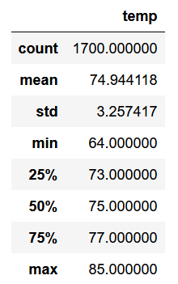
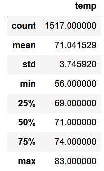

# Surf's up!

## Overview
The purpose of this analysis is to provide information about the temperature trends of Hawaii - particularly that of the variation between summer and winter - before committing to opening up a surf shop.
## Results
### June Temperatures

### December Temperatures

### Analysis
* There isn't a great amount of variation between June and December temps - June is only about three degrees hotter than December on average, minimum, maximum, and median.
* There's about the same standard deviation between the two sets of data at three degrees.
* There are about 200 more data points for for June than for December, which is 11% of the June data. There might be some shifts in the December data were there to be a sudden addition of those lacking 183 data points.
## Summary
Though there's a touch less data for December than for June, the temperature situation looks only a touch chillier in the beginning of winter than the beginning of summer - business all year round from the looks of it. Another query I'd like to use would be to check how frequent precipitation is in June and December. December looks like it is incapable of snow, but it's good to know whether it gets anything else and how different that is from June. Additionally, (after establishing a maximum threshold for how much precipitation can be endured before having to close for the day), it would be good to know how many days in June and December receive precipitation past the maximum amount tolerable. Essentially, I'd like to know how frequent is precipitiation to how frequent is too mcuh precipitation between those two months to create a more complete summer profile and winter profile.
